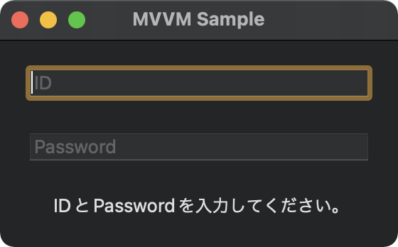
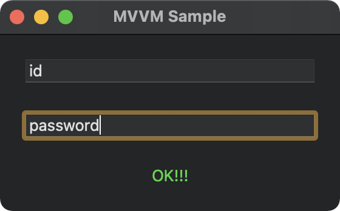

# MVVM-Sample-Combine-SwiftUI

[](https://github.com/Kyome22/MVVM-Sample-Combine-SwiftUI/issues)
[](https://github.com/Kyome22/MVVM-Sample-Combine-SwiftUI/network/members)
[](https://github.com/Kyome22/MVVM-Sample-Combine-SwiftUI/stargazers)
[](https://github.com/Kyome22/MVVM-Sample-Combine-SwiftUI/)
[](https://github.com/Kyome22/MVVM-Sample-Combine-SwiftUI/)

MVVM の練習に Combine と SwiftUI でシンプルなサンプルを作ってみたものです。<br/>
[iOS アプリ設計パターン入門の MVVM サンプル](https://github.com/peaks-cc/iOS_architecture_samplecode/tree/master/07)と同様のものを Combine で再現しています。

```plain:構造
┬─ Model
│   ├─ SampleModel (SampleModelProtocol)
│   └─ SampleModelError
│
├─ ViewModel
│   ├─ SampleViewModel
│   └─ Extension+SampleModelError
│
└─ View
    ├─ MVVM_Sample_Combine_SwiftUIApp
    └─ SampleView
```

## スクリーンショット





## テスト

- UnitTest
  - SampleModelTests
  - SampleViewModelTests
- UITest
  - MVVMSampleUITests
